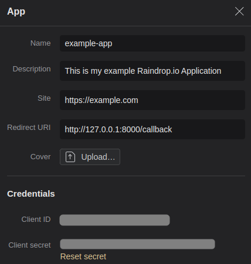

# Raindrop.io CommandLine Client Example

This is an example Raindrop.io python cmdline-tool to search within your bookmark library.

## Getting started 

### Register a new Application on Raindrop.io

To integrate your application with Raindrop.io and utilize its API, you first need to register your application on the Raindrop.io platform. This process will provide you with the necessary credentials, such as Client ID and Client Secret, required for OAuth authentication. Here's how you can do it:

1) Visit the Raindrop.io website.  Log in to your Raindrop.io account. If you don't have an account, you will need to create one.
2) Navigate to https://app.raindrop.io/settings/integrations
3) Look for a section named 'Developer' - Create a new Application
4) You will be presented with a form to fill out the details of your new application.



5) IMPORTANT: your "Redirect URI" has to match your application oauth-backend which handles your oauth-client-requests.

6) Save `CLIENT_ID` and `CLIENT_SECRET` to your `config.py`
7) Save your Application Settings on Raindrop.io

### Use `get-auth-token.py` to get an access-token

OAuth client-applications usually needs a webservice backend which handled the oauth client registration process.

This step is only needed if you have no access or refresh token for this commandline application.

The script `get-auth-token.py` requests access on the raindrop.io users account which via OAuth and saves the access-token in `token_raindrop.json`. 

It opens a webbrowser window on your local machine to the raindrop.io OAuth-Form.

To make this process so smooth as possible for small applications without integrated webservices to handle the redirect-requests. This script opens a webserver to handle that challenge to request the access-token and save it to the json-file `token_raindrop.json`.

## Search with `raindrop.py` on Raindrop.io

If everything has worked so far - you can now access raindrio.io via cmdline.

```
./raindrop.py --search [pattern]
```

### automatically refreshed access token

Script handles expired access_token and auto refresh the access token if needed.

## Why?

### In general

Wrote this example code as demo for another project and was handling OAuth access-roken requests the first time fully automatically in one script.

### sync / async code

Its intented that `get-auth-token.py` using sync-code with `requests`-library abd `raindrop.py` async-code with `aiohttp`. 

Its necessary anyway to answer the OAUth Request on a client with webbrowser frontend there is no need to write async code, while was writing async code on another project to access raindrop.io data.